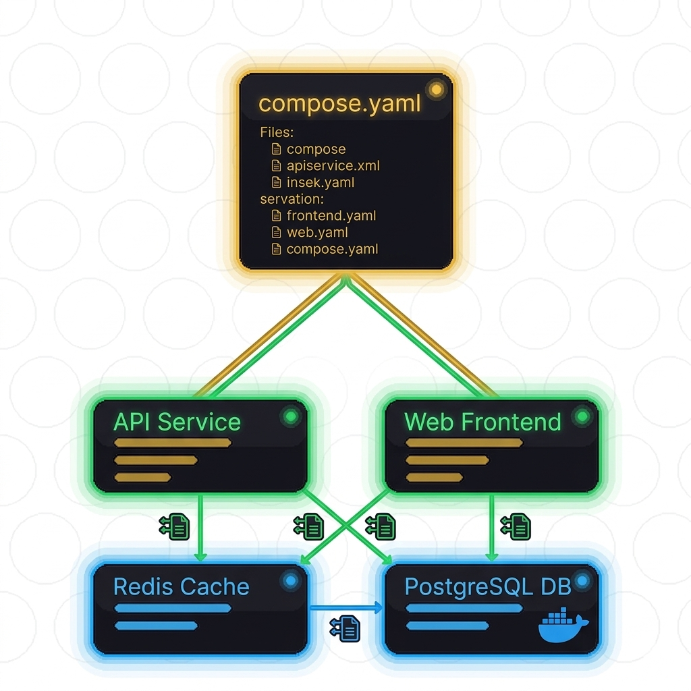

<p align="center">
  
</p>

<h1 align="center">DockerComposeVisualizer</h1>

<p align="center"><em>Works with Visual Studio Code &amp; Cursor</em></p>

<p align="center">
  <a href="https://code.visualstudio.com/">
    
  </a>
  &nbsp;
  <a href="https://cursor.com/">
    
  </a>
  &nbsp;
  <a href="https://docs.docker.com/compose/">
    
  </a>
</p>

<p align="center">
  See your docker compose stack boot in dependency order<br />
  <sub><code>dependency tree</code> · <code>live health</code> · <code>ports &amp; links</code> · <code>status bar</code> — auto-tracked from <code>docker compose up</code></sub>
</p>

<p align="center">
  <a href="https://github.com/hadiMh/Compose-Visual-VsCode-Extension/releases">
    
  </a>
  &nbsp;
  <a href="https://vsmarketplacebadges.dev/version/HadiHajihosseini.dockercompose-visualizer.svg">
    
  </a>
  &nbsp;
  <a href="https://vsmarketplacebadges.dev/installs/HadiHajihosseini.dockercompose-visualizer.svg">
    
  </a>
  &nbsp;
  <a href="https://github.com/hadiMh/Compose-Visual-VsCode-Extension/issues">
    
  </a>
</p>

<p align="center">
  <a href="https://marketplace.visualstudio.com/items?itemName=HadiHajihosseini.dockercompose-visualizer">
    
  </a>
  &nbsp;&nbsp;
  <a href="https://github.com/hadiMh/Compose-Visual-VsCode-Extension/releases">
    
  </a>
  &nbsp;&nbsp;
  <a href="#getting-started">
    
  </a>
</p>

<p align="center">
  
</p>

> **DockerComposeVisualizer** parses your compose file, lays out services by dependency tier, and updates each card as containers move through creating → starting → healthcheck → healthy. Dependencies light up when their parents are ready, so you can see *why* something is still waiting — without leaving the editor.

[Key features](#key-features) · [Features](#features) · [Getting started](#getting-started) · [How it works](#how-it-works) · [Commands](#commands) · [Configuration](#configuration) · [Development](#development) · [License](#license) · [Feedback](#feedback)

---

## Key features

Most compose workflows scatter status across terminals, `docker ps`, and guesswork about `depends_on`. DockerComposeVisualizer gives you one live view of **what is blocking what** while the stack boots.

| | |
|:---:|:---|
| 🌳 **Live dependency tree** | Services grouped by `depends_on` tiers with color-coded cards, optional tier dividers, and a configurable grid layout |
| 🔗 **Per-service dependency list** | See which upstream services each card is waiting on — running, in-progress, or not started |
| ⚡ **Auto-track on `compose up`** | Detects `docker compose up` (and custom patterns) in integrated terminals and starts tracking automatically |
| 🔍 **Auto-discover running stacks** | Polls `docker compose ls` and attaches when a stack for your workspace is already up |
| 📊 **Status bar progress** | Segmented bar showing how many services have reached your configured “up” state |
| 📜 **One-click logs** | Open `docker logs -f` for a service in a dedicated terminal (reused per service by default) |
| 🌐 **Port & link buttons** | Open published localhost ports; configure custom URLs per service from each card |
| ⏱️ **Boot timer** | Optional per-card timer from “deps ready” until healthy |
| ▶️ **Run / Stop (optional)** | Start or stop the stack from the sidebar header without switching to a terminal |
| ⚙️ **Sidebar settings** | Grid columns, legend, logs button, dependency list, and more — saved per workspace |

<p align="center">
  
</p>

<p align="center">
  
  &nbsp;&nbsp;
  
</p>

<p align="center">
  <sub><em>Status bar while booting (left) and when services are healthy (right)</em></sub>
</p>

---

## Features

- **Live dependency tree** — Services grouped by `depends_on` tiers with color-coded states and optional tier dividers.
- **Per-service dependency list** — See which upstream services each card is waiting on, with running / in-progress / not-started indicators.
- **Auto-track on `compose up`** — Detects `docker compose up` (and custom patterns) in integrated terminals and starts tracking automatically.
- **Auto-discover running stacks** — Polls `docker compose ls` and attaches when a stack for your workspace is already up.
- **Status bar progress** — Segmented bar showing how many services have reached your configured “up” state.
- **One-click logs** — Open `docker logs -f` for a service in a dedicated terminal (reused per service by default).
- **Port & link buttons** — Open published ports on localhost; configure custom URLs per service.

<p align="center">
  
  &nbsp;&nbsp;&nbsp;&nbsp;
  
</p>

<p align="center">
  <sub><em>Custom service links (left) and auto-detected port links (right)</em></sub>
</p>

- **Boot timer** — Optional per-card timer from “deps ready” until healthy.
- **Run / Stop (optional)** — Start or stop the stack from the sidebar without leaving the editor.
- **Sidebar settings** — Grid columns, legend, logs button, dependency list, and more — saved per workspace.

---

## Requirements

| Requirement | Notes |
|-------------|--------|
| **VS Code** ≥ 1.93 or **Cursor** (desktop) | Extension host with webview support |
| **Docker** | Engine running; `docker` CLI on your `PATH` |
| **docker compose** | V2 plugin (`docker compose`, not legacy `docker-compose` only) |
| **Compose file** | `compose.yaml`, `docker-compose.yml`, or a file you select in the sidebar |

---

## Getting started

### Install

#### 1. Install from the Marketplace

Open the Extensions view in **VS Code** or **Cursor**, search for **DockerComposeVisualizer**, and click **Install**.

Or use the Marketplace link:

[](https://marketplace.visualstudio.com/items?itemName=HadiHajihosseini.dockercompose-visualizer)

#### 2. Install from the terminal

**VS Code:**

```bash
code --install-extension HadiHajihosseini.dockercompose-visualizer
```

**Cursor:**

```bash
cursor --install-extension HadiHajihosseini.dockercompose-visualizer
```

To install a specific version:

```bash
code --install-extension HadiHajihosseini.dockercompose-visualizer@1.0.1
```

#### 3. Install from a release (.vsix)

1. Download the latest `dockercompose-visualizer-1.0.1.vsix` from [Releases](https://github.com/hadiMh/Compose-Visual-VsCode-Extension/releases).
2. Install the file:

**VS Code:**

```bash
code --install-extension /path/to/dockercompose-visualizer-1.0.1.vsix
```

**Cursor:**

```bash
cursor --install-extension /path/to/dockercompose-visualizer-1.0.1.vsix
```

You can also open the Extensions view, choose **Install from VSIX…**, and select the downloaded file.

3. Reload the window when prompted.

### Track your stack

1. **Open a workspace** that contains your compose YAML.
2. Open the **DockerComposeVisualizer** view on the activity bar (graph icon).
3. Click **Choose YAML file** at the top if no compose file is selected yet.
4. Run your stack — tracking starts automatically when `composeVisual.autoTrackOnComposeUp` is enabled (default):

   ```bash
   docker compose -f docker-compose.yml up
   ```

   Or use **DockerComposeVisualizer: Track Running Stack** from the Command Palette to attach to an already-running project.

Click the **status bar** item to open the sidebar or choose a compose file. Click a service’s **logs** icon to stream container logs.

---

## How it works

```text
compose.yaml  →  parse depends_on tiers  →  poll docker inspect
                      ↓
              webview cards + status bar
                      ↓
         terminal sniffer (compose up) / compose ls discovery
```

1. **Parse** — Reads `services` and `depends_on` (including conditions where present) and builds a tiered layout.
2. **Track** — Matches containers by Compose project + service labels (`com.docker.compose.*`).
3. **Reconcile** — Polls health on an interval; optional immediate reconcile when the compose terminal closes.
4. **Unlock** — A service’s “can run” state reflects whether dependency conditions are met, so cards pulse when they become runnable.

### Service states (legend)

| State | Meaning |
|-------|---------|
| Pending | Not started yet, or waiting on dependencies |
| Creating / Starting | Container lifecycle in progress |
| Running / Healthcheck | Up but not yet counted “healthy” (configurable) |
| Healthy | Reached your configured “up” threshold |
| Stopped / Error | Exited or failed |

---

## Commands

Open the Command Palette (`Ctrl+Shift+P` / `Cmd+Shift+P`) and search for **DockerComposeVisualizer**.

| Command | Description |
|---------|-------------|
| **DockerComposeVisualizer: Open or Track** | Status bar action — open sidebar or start tracking |
| **DockerComposeVisualizer: Open Sidebar** | Focus the Live Dependency Tree view |
| **DockerComposeVisualizer: Open Settings** | Jump to `composeVisual.*` in Settings |
| **DockerComposeVisualizer: Track Compose Stack** | Pick a compose file and prepare tracking |
| **DockerComposeVisualizer: Track Running Stack** | Attach to an already-running project |
| **DockerComposeVisualizer: Stop Tracking** | Clear tracking and status bar |

---

## Configuration

All settings live under **`composeVisual.*`**. Open Settings and search for `DockerComposeVisualizer`, or edit `settings.json`.

### Tracking & discovery

| Setting | Default | Description |
|---------|---------|-------------|
| `autoTrackOnComposeUp` | `true` | Start tracking when `docker compose up` is detected in a terminal |
| `autoDiscoverRunningStack` | `true` | Poll for a running stack in this workspace |
| `discoveryPollIntervalSeconds` | `6` | Poll interval for auto-discover |
| `composeFile` | `""` | Workspace-relative compose file (also saved in `.composeVisual/sidebar-settings.json`) |
| `defaultComposeFilePatterns` | `compose.yaml`, … | Filenames tried when resolving the compose file |
| `projectName` | `""` | Override Compose project name (`-p`) |
| `healthPollIntervalSeconds` | `3` | Docker inspect poll interval while tracking |
| `markHealthyWhen` | `healthy` | Count “up” at `healthy` or `running` |

### Sidebar UI

| Setting | Default | Description |
|---------|---------|-------------|
| `showDependencyList` | `true` | List `depends_on` services on each card |
| `showLogsButton` | `true` | Per-service logs button |
| `showPortButtons` | `true` | Auto-detected localhost port links |
| `showBootTimer` | `true` | Seconds-to-healthy timer on cards |
| `showComposeRunButton` | `false` | Run / Stop stack from sidebar header |
| `composeRunExtraArgs` | `""` | Extra args for Run (e.g. `--env-file .env up -d`) |
| `gridColumns` | `auto` | `2`, `3`, or responsive `auto` |
| `showLegend` | `true` | State color legend under the tree |

### Logs & links

| Setting | Default | Description |
|---------|---------|-------------|
| `logsFollow` | `true` | `docker logs -f` vs last 200 lines |
| `reuseLogsTerminal` | `true` | One terminal per service name |
| `serviceLinks` | `{}` | Map service names → URL buttons (see below) |
| `showServiceLinksWhen` | `healthy` | When custom links appear |
| `openLinksInExternalBrowser` | `false` | System browser vs Simple Browser |

**Example — custom service links** in `settings.json`:

```json
{
  "composeVisual.serviceLinks": {
    "frontend": [
      { "label": "App", "url": "http://localhost:3000" }
    ],
    "api": "http://localhost:8000/docs"
  }
}
```

Per-project links can also be edited from each card’s **settings** icon; they are stored in `.composeVisual/service-links.json`.

### Where data is stored

| Location | Contents |
|----------|----------|
| `.composeVisual/sidebar-settings.json` | UI preferences from the in-sidebar settings panel |
| `.composeVisual/service-links.json` | Per-service link overrides from the card editor |
| Extension global state | Whether the user has clicked the marketplace rating prompt |

---

## Development

### Prerequisites

- Node.js 18+
- npm
- VS Code or Cursor for Extension Development Host debugging
- Docker with Compose V2 for end-to-end testing

### Clone and build

```bash
git clone https://github.com/hadiMh/Compose-Visual-VsCode-Extension.git
cd Compose-Visual-VsCode-Extension
npm install
npm run compile
```

Press **F5** in VS Code or Cursor to launch an **Extension Development Host** with this folder as `extensionDevelopmentPath`.

### Scripts

| Script | Description |
|--------|-------------|
| `npm run compile` | One-shot TypeScript build → `out/` |
| `npm run watch` | Watch mode for development |
| `npm run package` | Build a `.vsix` via `vsce package` |

### Package a VSIX

```bash
npm install -g @vscode/vsce
npm run compile
vsce package
```

Install locally:

```bash
code --install-extension dockercompose-visualizer-1.0.1.vsix
```

`out/` must be compiled first; `src/` is excluded from the published extension via `.vscodeignore`.

---

## License

Copyright © 2026 **Hadi Hajihosseini**. **DockerComposeVisualizer Source License** (see [LICENSE](LICENSE)).

- You may **use, modify, and run** this project for yourself or your team.
- **Contributions** are welcome via **pull requests** to the [official repository](https://github.com/hadiMh/Compose-Visual-VsCode-Extension).
- You may **not publish** this code (or derivatives) as an extension or plugin for **any editor or IDE** (VS Code, Cursor, JetBrains, Vim/Neovim, etc.) on any marketplace or registry without permission from the copyright holder.

---

## Feedback

Found a bug or have an idea?

[](https://github.com/hadiMh/Compose-Visual-VsCode-Extension/issues)
&nbsp;&nbsp;
[](https://github.com/hadiMh/Compose-Visual-VsCode-Extension/pulls)
&nbsp;&nbsp;
[](https://marketplace.visualstudio.com/items?itemName=HadiHajihosseini.dockercompose-visualizer&ssr=false#review-details)

---

<p align="center">
  If this project helps you, consider giving it a ⭐ on <a href="https://github.com/hadiMh/Compose-Visual-VsCode-Extension">GitHub</a> or a review on the <a href="https://marketplace.visualstudio.com/items?itemName=HadiHajihosseini.dockercompose-visualizer">Marketplace</a>.<br /><br />
  <strong>DockerComposeVisualizer</strong> — created by <a href="https://github.com/hadiMh">Hadi Hajihosseini</a>.<br />
  Clarity for multi-service local development, without leaving the editor.
</p>
